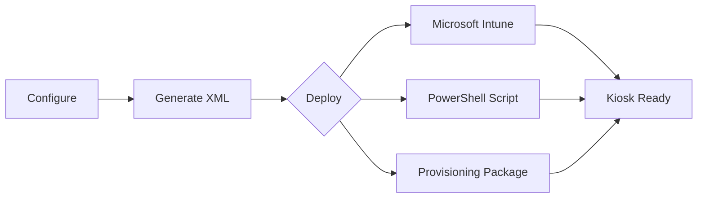
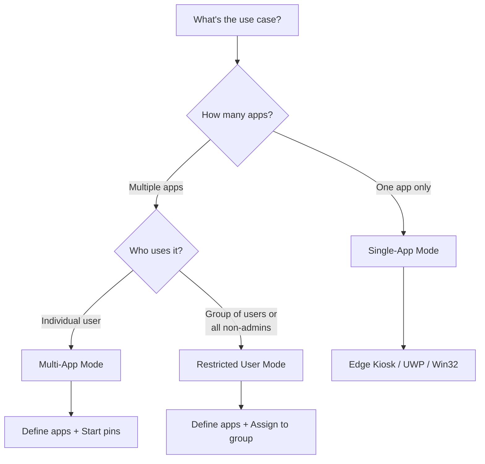
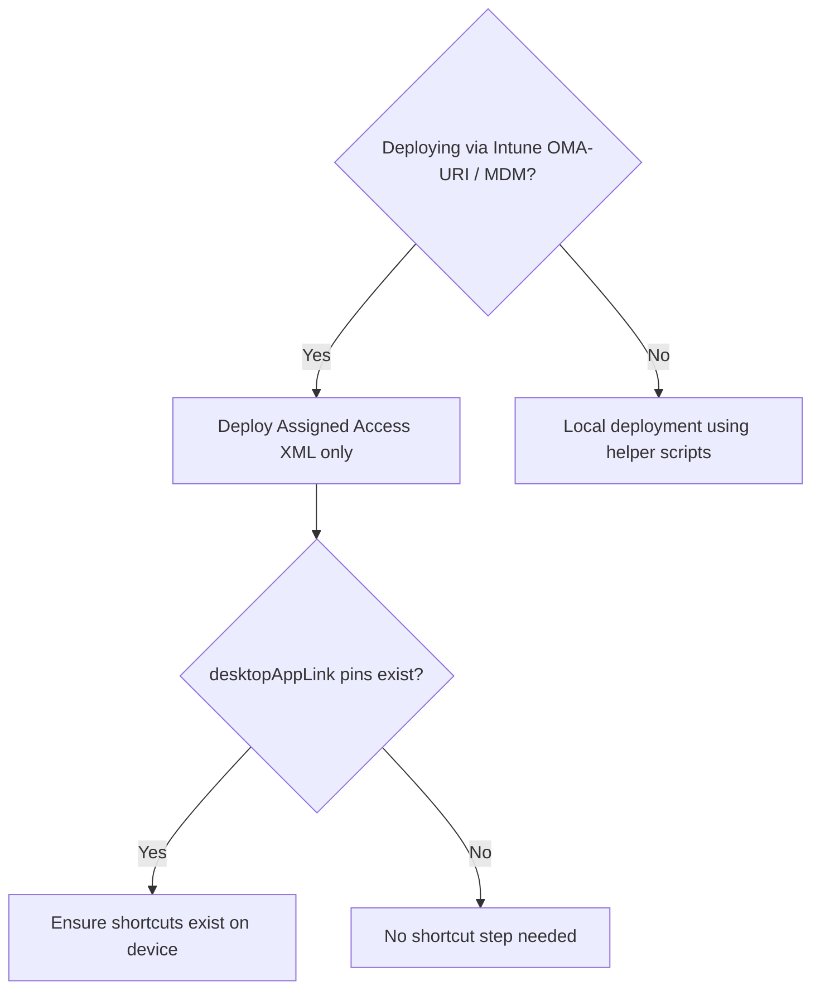

# AssignedAccess XML Builder

A guided builder for Windows kiosk configurations—no XML expertise required.

**Hosted app:** https://mksa.pages.dev

## Executive Summary

| Challenge | Solution |
|-----------|----------|
| Manual XML authoring is error-prone and time-consuming | Point-and-click interface generates valid XML instantly |
| Inconsistent kiosk configurations across devices | Standardized templates ensure uniform deployments |
| Debugging malformed XML wastes engineering hours | Built-in validation catches errors before deployment |

**Result**: Reduce kiosk configuration time from hours to minutes while eliminating deployment failures caused by XML syntax errors.

---

## How It Works



1. **Configure** — Select kiosk mode, apps, and account settings
2. **Validate** — XML is generated with real-time validation
3. **Deploy** — Export to Intune, PowerShell, or PPKG

---

## Choosing a Kiosk Mode



| Mode | Best For | Account Types | Example |
|------|----------|---------------|---------|
| **Single-App** | Signage, check-in terminals | Auto Logon, Existing User | Lobby display showing company website |
| **Multi-App** | Shared workstations, frontline workers | Auto Logon, Existing User | Reception desk with Edge, Teams, Outlook |
| **Restricted User** | Classrooms, shared labs, group policies | User Groups, Global Profile | Student computers with limited apps |

---

## Features

### Kiosk Modes
- **Single-App** — One app in kiosk mode (Edge, UWP, or Win32)
- **Multi-App** — Multiple apps with a custom Start menu
- **Restricted User** — Multi-app with group-based assignment

### Applications
- Microsoft Edge kiosk (web URLs or local HTML files)
- UWP/Store apps and Win32 desktop apps
- 30+ app presets (browsers, Office, utilities)
- Edge idle timeout for public kiosks

### Start Menu & Taskbar
- Start menu pins and Edge site tiles from allowed apps
- Taskbar show/hide control
- Taskbar pin layout (custom)
- File Explorer restrictions (downloads, removable drives, or full access)

### Account Options
- Auto-logon (managed local account)
- Existing user (local, domain, or Azure AD)
- User groups (Local, AD, or Azure AD groups) — Restricted mode
- Global profile (all non-admin users) — Restricted mode
- Restricted User supports User Group or Global Profile only

### Security & Access
- Breakout sequence for technician access (Ctrl+Alt+K)
- Auto-launch app configuration

### Export & Deploy
- Real-time XML validation with contextual tooltips
- PowerShell deploy script with NDJSON logging in `%ProgramData%\AssignedAccessXMLBuilder\Logs`
- Shortcut-only script for Start Menu and Taskbar pins (Intune/OMA-URI scenarios)
- Start layout XML download for Intune file uploads
- Import/export XML configurations
- Deployment guidance for Intune, PowerShell, and PPKG

Note: Intune’s Settings Catalog kiosk allow-list is AUMID-only. Use the OMA-URI AssignedAccess CSP when you need Win32 apps like `osk.exe` or `sndvol.exe`.

Note: If Windows blocks a downloaded script, right-click the `.ps1` file, choose **Properties**, then **Unblock**.

### Accessibility
- Dark/light theme
- WCAG-aligned UI
- Keyboard navigation

### Guidance
- Progress rail and onboarding tips for first-time setup

---

## Getting Started

**Option 1: Use the Hosted Tool (Recommended)**

Open `https://aaxb.pages.dev` in any modern browser.
Use the left sidebar to navigate between Setup, Applications, Start Menu, System, and Summary.

**Option 2: Run Locally**

Because the app loads presets with `fetch()`, serve the repo from a local web server:
```
1. Download or clone repository
2. Run: python -m http.server
3. Open http://localhost:8000
4. Configure and export
```

**Option 3: Host Internally** — Deploy to any web server. No backend required.

---

## Requirements

| Component | Requirement |
|-----------|-------------|
| Target OS | Windows 11 22H2+ (Windows 10 with limited features) |
| Edition | Pro, Enterprise, or Education |
| Browser | Any modern browser (Chrome, Edge, Firefox) |
| Deployment | Intune, PPKG, or PowerShell with SYSTEM privileges |

---

## Documentation

See [REFERENCE.md](REFERENCE.md) for detailed deployment instructions, troubleshooting, and technical reference.

---

## Deployment flows (visual)

### Flow 1: Deployment decision



### Flow 2: Local deployment sequence

```mermaid
flowchart TD
    A[Export artifacts from AAXB] --> B{desktopAppLink pins exist?}
    B -->|Yes| C[Run Shortcut Creator]
    B -->|No| D[Skip Shortcut Creator]
    C --> E{Need Edge custom name/icon?}
    D --> E
    E -->|Yes| F[Run Edge Manifest Workaround (unsupported)]
    E -->|No| G[Skip Edge workaround]
    F --> H[Run Apply Assigned Access script]
    G --> H
    H --> I[Reboot and validate kiosk]
```

Notes:
- **desktopAppLink** pins reference a `.lnk` shortcut path.
- **Shortcut Creator** is only needed if those `.lnk` shortcuts do not already exist on the target device.
- **Edge Manifest Workaround** is optional, unsupported by Microsoft, and intended only for managed kiosk devices.

---

## Edge VisualElements Manifest Workaround (Advanced)

### 1) The Problem Being Solved
Windows Assigned Access (kiosk mode) is not the same as a normal user session. In kiosk mode, Windows renders Start menu and taskbar tiles based on application identity rather than shortcut metadata. When multiple shortcuts launch Microsoft Edge (`msedge.exe`), Windows often renders them all with the same branding:
- Name: “Microsoft Edge”
- Icon: the Edge icon

This happens even if the `.lnk` file defines a custom name and custom icon.

### 2) Why .lnk Metadata Is Ignored in This Scenario
Windows determines the name and icon for pinned items using the application’s identity (AppUserModelID / registered app visuals) and VisualElements manifests. Microsoft Edge ships with a VisualElements manifest that declares its display name and icon. In Assigned Access, Windows prefers the application’s own identity and VisualElements over shortcut metadata. This is Windows behavior and not a bug in AAXB.

### 3) What the Edge VisualElements Manifest Workaround Does
The VisualElements manifest is a small file that tells Windows how an application’s tile should look. The workaround renames Edge’s VisualElements manifest file so Windows can no longer use it. When that file is unavailable, Windows may fall back to the `.lnk` metadata (name/icon) when rendering tiles for Edge-based shortcuts. This does not modify the shortcuts themselves; it changes which metadata Windows chooses to trust.

### 4) Why This Is Optional and Advanced
This workaround is not supported or documented by Microsoft. Modifying Edge installation files is unsupported, and Edge updates may restore the VisualElements manifest at any time. The export includes a scheduled task so the rename can be re-applied after updates. Risks include:
- It may stop working after Windows or Edge updates.
- It may be flagged by security/compliance tooling.
- It requires administrative control of the device.

### 5) When You Should Consider Using This Workaround
Use it only if you need distinct names and icons for multiple Edge-launched web apps in Assigned Access. For example:
- A kiosk with multiple web apps pinned via Edge that must be clearly distinguishable.
- A kiosk where operators rely on unique icons for quick recognition.

Do not use it if:
- Default Edge branding is acceptable.
- Your security policy forbids modifying installed application files.
- You can use a supported alternative such as PWAs or packaged apps.

### 6) Supported Alternatives
Preferred, supported approaches for distinct icons/names:
- Edge-installed PWAs (each PWA has its own application identity).
- Packaged applications (MSIX/UWP) with unique AppUserModelIDs.
- Edge secondary tiles (Start menu only), which support custom displayName.

These alternatives are supported by Windows and Microsoft and should be used when feasible.

---

## Contributing

Contributions welcome. Submit issues or pull requests on GitHub.

## Credits

Created by [Joshua Walderbach](https://www.linkedin.com/in/joshua-walderbach/)

Inspired by [Brandon Villines](https://www.linkedin.com/in/brandon-villines/)

## License

MIT License — free to use, modify, and distribute.
