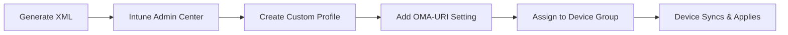

# Technical Reference

Technical reference for Kiosk Overseer.

**Note:** Local use should be served from a web server (not `file://`) so preset JSON loads correctly. Windows 11 is required.

---

## Usage Examples

### Single-App Kiosk (Edge)

1. Select **Single-App** mode
2. Choose **Microsoft Edge (Kiosk Mode)**
3. Select source type:
   - **Web URL** — Enter a website address (e.g., `https://example.com`)
   - **Local File** — Enter a file path (e.g., `C:/Kiosk/index.html`). Spaces are encoded automatically.
4. Select kiosk type:
   - **Fullscreen** — No browser UI (digital signage)
   - **Public Browsing** — Address bar and navigation visible
5. Set **Idle Timeout** (optional) — Reset to home URL after inactivity
6. Taskbar settings are not available in Single-App mode (taskbar is hidden by design)
7. Optionally enable **Breakout Sequence** for technician access (Ctrl+Alt+K)
8. Configure account (Auto-logon recommended)
9. Export

### Multi-App Kiosk

1. Select **Multi-App** mode
2. Add allowed applications:
   - Use Common Apps buttons or add manually
   - Manual entry: Path (.exe) for Win32 apps, AUMID for UWP apps
3. Configure auto-launch (optional):
   - Select an app to launch automatically at sign-in
   - If Edge is selected, configure URL and kiosk type
4. Add Start menu pins:
   - Create pins for apps users should see in the Start menu
   - Each pin needs: Name, Target path, optional arguments/icon
   - Icon files must exist on the target device; the tool creates shortcuts but does not deploy icons
   - Use Edge Secondary Tile for pinned websites
5. Configure taskbar pins (optional): add apps to appear on the taskbar
6. Configure **Taskbar** and **File Explorer** settings in Setup
7. Optionally configure **Desktop Wallpaper** (solid color or image path on target device)
8. Optionally enable **Browser Watchdog** to relaunch the auto-launch browser if closed by idle timeout
9. Configure account (Auto-logon or Existing Account)
10. Export

### Restricted User Experience

Use this mode when you need to apply the same restricted desktop to multiple users via group membership.

1. Select **Restricted User** mode
2. Add allowed applications (same as Multi-App)
3. Add Start menu pins (same as Multi-App)
4. Configure taskbar pins (optional)
5. Configure **Taskbar** and **File Explorer** settings in Setup
6. Choose account type:
   - **User Group** — Apply to members of a specific group
     - Local Group: `KioskUsers`
     - AD Group: `DOMAIN\KioskUsers`
     - Azure AD Group: Use the Group Object ID (GUID)
   - **Global Profile** — Apply to ALL non-administrator users on the device
7. Export

**Note:** Restricted User mode supports User Group or Global Profile only. Users must sign in with their own credentials.

---

## Deployment

### Microsoft Intune (Recommended)



**OMA-URI Setting:**
| Field | Value |
|-------|-------|
| Name | AssignedAccess Configuration |
| OMA-URI | `./Vendor/MSFT/AssignedAccess/Configuration` |
| Data type | String |
| Value | *Paste generated XML* |

**Why OMA-URI over the Settings Catalog kiosk template?**
The Settings Catalog multi-app kiosk allow-list is AUMID-based and does not support Win32 `DesktopAppPath` entries. Use OMA-URI when you need Win32 apps like `C:\Windows\System32\osk.exe` or `C:\Windows\System32\sndvol.exe`.

### PowerShell Script

1. Click **Apply Assigned Access (PowerShell)**
2. Run as SYSTEM on target device:
   ```powershell
   psexec.exe -i -s powershell.exe -ExecutionPolicy Bypass -File "AssignedAccess-<Config>.ps1"
   ```
3. The script performs:
   - Pre-flight checks (Windows edition, SYSTEM context via SID S-1-5-18, WMI availability)
   - Enables process creation auditing, command-line capture, and sets Security log size to 512MB (best effort)
   - Creates shortcuts in `%ALLUSERSPROFILE%\Microsoft\Windows\Start Menu\Programs\` for Start and Taskbar pins
   - Configures desktop wallpaper if set (solid color via registry or image path)
   - Creates Browser Watchdog scheduled task if enabled (monitors and relaunches browser)
   - Applies configuration via WMI (`MDM_AssignedAccess`)
   - Generates CMTrace-compatible log file with timestamps and execution details in `%ProgramData%\\KioskOverseer\\Logs`
4. Reboot

**Shortcut-Only Script (Intune/OMA-URI):**
- Click **Shortcut Creator (PowerShell)** to generate only the Start and Taskbar .lnk files
- Run as Administrator on target devices to populate the Start Menu Programs folder
- If Windows blocks the script, right-click the .ps1 file, choose **Properties**, then **Unblock**

### Provisioning Package (PPKG)

1. Generate XML
2. In Windows Configuration Designer:
   - Create provisioning package
   - Navigate to **Runtime Settings > AssignedAccess > AssignedAccessSettings**
   - Paste XML
3. Build and apply package

---

## Troubleshooting

| Symptom | Cause | Solution |
|---------|-------|----------|
| "Operation cancelled due to restrictions" | Win32 app blocked by RestrictRun registry | Use Edge kiosk mode or ensure all required executables are allowed |
| Kiosk not applying after reboot | Invalid XML or insufficient privileges | Validate XML in tool; ensure script ran as SYSTEM |
| Configuration partially applied | XML namespace mismatch | Regenerate XML; check Windows version compatibility |
| Start menu pins not appearing | Shortcut file missing or invalid path | Verify shortcuts exist in the Start Menu Programs folder and match paths in StartPins JSON; use the deploy or shortcut-only script to auto-create Start/Taskbar shortcuts |
| Edge not launching in kiosk mode | Missing Edge components in allowed apps | Add Edge via Common Apps or include msedge.exe, msedge_proxy.exe, and the Edge packaged app ID manually |
| Auto-launch app not starting | App not in AllowedApps list | Ensure the auto-launch app is also added to the allowed applications list |
| SYSTEM context check fails | Script not running as SYSTEM | Use `psexec -i -s` to run PowerShell as SYSTEM |
| "Unsupported edition" error | Windows Home edition | Kiosk mode requires Pro, Enterprise, or Education |

**Diagnostic logs:** `Event Viewer > Applications and Services Logs > Microsoft > Windows > AssignedAccess`

**Remove configuration:** `Clear-AssignedAccess` cmdlet or unassign Intune profile

---

## Themes

Use the **Theme** toggle next to the build label to switch between the Fallout theme and the Fluent-inspired alternative. The choice is saved in local storage.

---

## XML Namespaces

| Namespace | Windows Version | Features Added |
|-----------|-----------------|----------------|
| `2017/config` | Base | Core kiosk functionality |
| `201901/config` (rs5) | 1903+ | DisplayName for auto-logon, AutoLaunch |
| `2020/config` (v3) | 20H2+ | AllowRemovableDrives, GlobalProfile |
| `2021/config` (v4) | 21H2+ | ClassicAppPath, BreakoutSequence |
| `2022/config` (v5) | 22H2+ | StartPins (Windows 11) |

---

## Edge Kiosk Configuration

### Important: Edge Chromium is a Win32 App

Edge Chromium (the current version of Edge) is a **desktop application**, not a UWP app. This affects how it's configured:

| Mode | Configuration Method |
|------|---------------------|
| Single-App | `v4:ClassicAppPath="%ProgramFiles(x86)%\Microsoft\Edge\Application\msedge.exe"` |
| Multi-App | `<App DesktopAppPath="%ProgramFiles(x86)%\Microsoft\Edge\Application\msedge.exe"/>` |

**Do NOT use** `AppUserModelId="MSEdge"` — that refers to the legacy Edge browser.

### Edge Kiosk Arguments

| Argument | Description |
|----------|-------------|
| `--kiosk <URL>` | Sets the starting URL |
| `--edge-kiosk-type=fullscreen` | No browser chrome, just content |
| `--edge-kiosk-type=public-browsing` | Address bar and navigation visible |
| `--no-first-run` | Prevents first-run experience dialog |
| `--kiosk-idle-timeout-minutes=N` | Reset to home URL after N minutes of inactivity |

> **Note:** Both kiosk types automatically run as InPrivate sessions. The `--inprivate` flag is not needed.

### Edge Allowed Apps for Secondary Tiles

When using Edge StartPins secondary tiles, include all required Edge entries in the allowed apps list:
- `%ProgramFiles(x86)%\Microsoft\Edge\Application\msedge.exe`
- `%ProgramFiles(x86)%\Microsoft\Edge\Application\msedge_proxy.exe`
- `Microsoft.MicrosoftEdge.Stable_8wekyb3d8bbwe!App`

---

## Account Types

| Type | XML Element | Supported Modes |
|------|-------------|-----------------|
| Auto-logon | `<AutoLogonAccount rs5:DisplayName="..."/>` | Single, Multi, Restricted |
| Existing Account | `<Account>username</Account>` | Single, Multi, Restricted |
| User Group | `<UserGroup Type="..." Name="..."/>` | Restricted only |
| Global Profile | `<v3:GlobalProfile Id="..."/>` | Restricted only |

### User Group Types

| Type | Name Format | Example |
|------|-------------|---------|
| LocalGroup | Group name | `KioskUsers` |
| ActiveDirectoryGroup | DOMAIN\GroupName | `CONTOSO\KioskUsers` |
| AzureActiveDirectoryGroup | Group Object ID | `a1b2c3d4-e5f6-7890-abcd-ef1234567890` |

---

## Common AUMIDs

| Application | AUMID |
|-------------|-------|
| Calculator | `Microsoft.WindowsCalculator_8wekyb3d8bbwe!App` |
| Photos | `Microsoft.Windows.Photos_8wekyb3d8bbwe!App` |
| Settings | `windows.immersivecontrolpanel_cw5n1h2txyewy!microsoft.windows.immersivecontrolpanel` |
| Windows Terminal | `Microsoft.WindowsTerminal_8wekyb3d8bbwe!App` |
| Snipping Tool | `Microsoft.ScreenSketch_8wekyb3d8bbwe!App` |
| Sticky Notes | `Microsoft.MicrosoftStickyNotes_8wekyb3d8bbwe!App` |
| Paint | `Microsoft.Paint_8wekyb3d8bbwe!App` |
| Camera | `Microsoft.WindowsCamera_8wekyb3d8bbwe!App` |
| Movies & TV | `Microsoft.ZuneVideo_8wekyb3d8bbwe!Microsoft.ZuneVideo` |
| Teams | `MSTeams_8wekyb3d8bbwe!MSTeams` |
| OneNote | `Microsoft.Office.OneNote_8wekyb3d8bbwe!microsoft.onenoteim` |

**Find any app's AUMID:**
```powershell
Get-StartApps | Format-Table Name, AppID
```

---

## Common Executable Paths

| Application | Path |
|-------------|------|
| Edge | `%ProgramFiles(x86)%\Microsoft\Edge\Application\msedge.exe` |
| Chrome | `C:\Program Files\Google\Chrome\Application\chrome.exe` |
| Firefox | `C:\Program Files\Mozilla Firefox\firefox.exe` |
| Notepad | `C:\Windows\System32\notepad.exe` |
| On-Screen Keyboard | `C:\Windows\System32\osk.exe` |
| Command Prompt | `C:\Windows\System32\cmd.exe` |
| PowerShell | `C:\Windows\System32\WindowsPowerShell\v1.0\powershell.exe` |
| File Explorer | `C:\Windows\explorer.exe` |
| Control Panel | `C:\Windows\System32\control.exe` |
| Volume Control | `C:\Windows\System32\sndvol.exe` |

---

## StartPins JSON Format (Windows 11)

The StartPins element uses JSON to define pinned shortcuts. Desktop shortcuts must point to .lnk files in the Start Menu Programs folder. Three formats are supported:

```json
{
  "pinnedList": [
    // UWP/Store apps - use packagedAppId
    {"packagedAppId": "Microsoft.WindowsCalculator_8wekyb3d8bbwe!App"},

    // Desktop apps - use desktopAppLink with .lnk path
    {"desktopAppLink": "%ALLUSERSPROFILE%\\Microsoft\\Windows\\Start Menu\\Programs\\Notepad.lnk"},

    // Edge pinned sites - use secondaryTile
    {"secondaryTile": {
      "tileId": "MSEdge.pinnedsite",
      "displayName": "Company Intranet",
      "arguments": "https://intranet.company.com",
      "packagedAppId": "Microsoft.MicrosoftEdge.Stable_8wekyb3d8bbwe!App"
    }}
  ]
}
```

**Start Layout XML Download:** Use **Download Start Layout XML** to export a LayoutModification XML file for Intune Start layout file uploads.


---

## Resources

- [AssignedAccess CSP Reference](https://learn.microsoft.com/en-us/windows/client-management/mdm/assignedaccess-csp)
- [Set Up a Kiosk on Windows 11](https://learn.microsoft.com/en-us/windows/configuration/kiosk-methods)
- [Configure Microsoft Edge Kiosk Mode](https://learn.microsoft.com/en-us/deployedge/microsoft-edge-configure-kiosk-mode)
- [Assigned Access Configuration File](https://learn.microsoft.com/en-us/windows/configuration/assigned-access/configuration-file)
